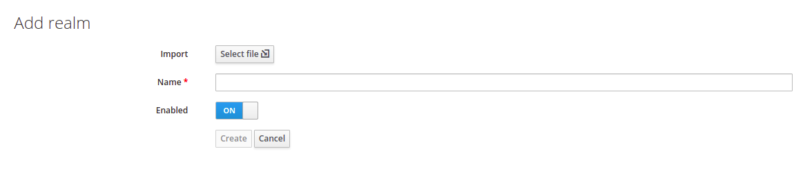

# == Quick Start ==

Run the following command inside the quick-start folder:

```sh

$ docker-compose up -d

```

# Nexus

+ URL: http://localhost:8081
+ User: admin
+ Password: get the passoword running the following command:
    ```
    docker-compose exec nexus cat /nexus-data/admin.password
    ```
+ Add admin permission to anonymous user.
    + Go to Administration menu, select User and click over anonymous user.
        + Add nx-amin role to the annymous user.


+ Build the extension to populate the repository with the current version.

```
mvn clean deploy -DaltDeploymentRepository=repo::default::http://localhost:8081/repository/maven-snapshots
```

+ Check out the Nexus repository


# KeyCLoak

+ URL: http://localhost:8090
+ Login at Console Administration
    + User: admin
    + Password: admin
+ After the instalation is finished, its necessary create the realm in the KeyCloak importing configurations:
    + Go to KeyCloak interface and select the option ```Add realm```.
    + Import ```realm-export.json``` file from quick-start folder.
        + Check ```Enable``` option and click over ```Create``` button.  



+ Create a new user.


+ Add password to user


# XWiki

+ URL: http://localhost:8080
+ Complete the instalations quick-start of XWiki


+ Run the following command inside the quick-start folder:
```
$ ./setup.sh
```

+ Next step is go to Administer Wiki menu and Extensions.
    + Wait for the indexing completed.
    
    

    + To find the extension, its necessary click over More button and Advanced search link:
        + EXTENSION ID: org.xwiki.contrib.authentication:xwiki-authenticator-saml20
        + VERSION: 1.0-SNAPSHOT
    + CLick over the install button and wait until finish the instalation process.


---

# == Manual Setup ==

1. Build the project

```sh
mvn clean install
```

2. Create a folder to store the maven repository files for you wiki. Let's assume for this example it will be in the following place

```sh
/usr/local/xwiki/data/repo/org/xwiki/contrib/authentication/xwiki-authenticator-saml20/1.0-SNAPSHOT
```

3. Copy all files from your maven local repo

```sh
$M2_HOME/repository/org/xwiki/contrib/authentication/xwiki-authenticator-saml20/1.0-SNAPSHOT
```

to the directory created on step 2.

4. Add the following lines to xwiki.properties

```sh
extension.repositories=local:maven:file:///usr/local/xwiki/data/repo
extension.repositories=maven-xwiki:maven:https://nexus.xwiki.org/nexus/content/groups/public/
extension.repositories=extensions.xwiki.org:xwiki:https://extensions.xwiki.org/xwiki/rest/
```

5. For Google Workspace, you need to make sure you are behind https. If you are behind a reverse proxy, you might
face issues with wrong http redirections. Try adding the following to your web.xml 
   
```sh
    <filter>
        <filter-name>RemoteIpFilter</filter-name>
        <filter-class>org.apache.catalina.filters.RemoteIpFilter</filter-class>
        <init-param>
            <param-name>protocolHeader</param-name>
            <param-value>x-forwarded-proto</param-value>
        </init-param>
       <init-param>
            <param-name>remoteIpHeader</param-name>
            <param-value>x-forwarded-for</param-value>
       </init-param>
    </filter>
```

== Notice ==

It is still possible to authenticate against the local authentication. To do that, open the login form URL directly:

    https://<your wiki domain>/bin/login/XWiki/XWikiLogin
