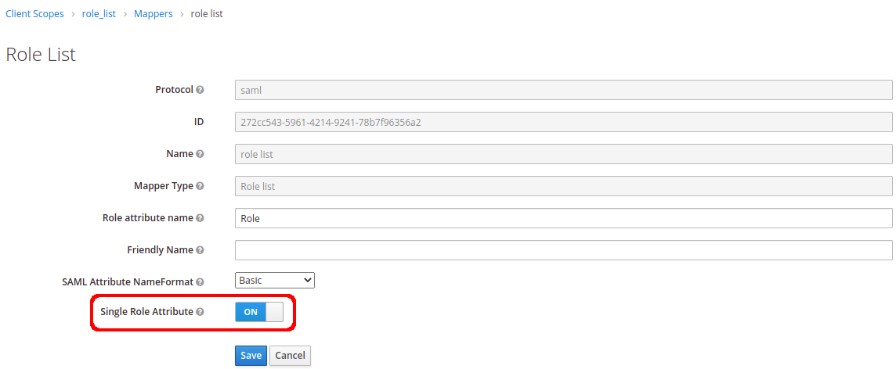

# Keycloak setup instructions

Follow these instructions to set up Keycloak as the IDP for XWIKI

## Step 1) Create your realm
+ [Follow the instructions in Keycloak documentation.](https://www.keycloak.org/docs/latest/getting_started)


+ After you create the new realm, you should download the ```Identity Provider Metada``` XML by clicking on the region pointed out above.

The file will look like as follows:

```xml
<!--Identity Provider Metadata XML Example:-->

<!-- "xwiki.authentication.saml2.idp.entityid" will come from the following attribute `entityID` -->
<EntityDescriptor xmlns="urn:oasis:names:tc:SAML:2.0:metadata" xmlns:md="urn:oasis:names:tc:SAML:2.0:metadata" xmlns:saml="urn:oasis:names:tc:SAML:2.0:assertion" xmlns:ds="http://www.w3.org/2000/09/xmldsig#" entityID="http://<keycloak-url>/auth/realms/<realm-name>">
	<IDPSSODescriptor WantAuthnRequestsSigned="true" protocolSupportEnumeration="urn:oasis:names:tc:SAML:2.0:protocol">
		<KeyDescriptor use="signing">
			<KeyInfo>
				<KeyName>
					...
				</KeyName>
				<X509Data>
          <!-- "xwiki.authentication.saml2.idp.x509cert" will come from the following attribute -->
					<X509Certificate>
						...
					</X509Certificate>
				</X509Data>
			</KeyInfo>
		</KeyDescriptor>
		<ArtifactResolutionService Binding="urn:oasis:names:tc:SAML:2.0:bindings:SOAP" Location="<keycloak-url>/auth/realms/<realm-name>/protocol/saml/resolve" index="0" />
		<SingleLogoutService Binding="urn:oasis:names:tc:SAML:2.0:bindings:HTTP-POST" Location="<keycloak-url>/auth/realms/<realm-name>/protocol/saml" />
		<SingleLogoutService Binding="urn:oasis:names:tc:SAML:2.0:bindings:HTTP-Redirect" Location="<keycloak-url>/auth/realms/<realm-name>/protocol/saml" />
		<SingleLogoutService Binding="urn:oasis:names:tc:SAML:2.0:bindings:HTTP-Artifact" Location="<keycloak-url>/auth/realms/<realm-name>/protocol/saml" />
		<NameIDFormat>
			urn:oasis:names:tc:SAML:2.0:nameid-format:persistent
		</NameIDFormat>
		<NameIDFormat>
			urn:oasis:names:tc:SAML:2.0:nameid-format:transient
		</NameIDFormat>
		<NameIDFormat>
			urn:oasis:names:tc:SAML:1.1:nameid-format:unspecified
		</NameIDFormat>
		<NameIDFormat>
			urn:oasis:names:tc:SAML:1.1:nameid-format:emailAddress
		</NameIDFormat>
    <!-- "xwiki.authentication.saml2.idp.single_sign_on_service.url" will come from the following attribute -->
		<SingleSignOnService Binding="urn:oasis:names:tc:SAML:2.0:bindings:HTTP-POST" Location="<keycloak-url>/auth/realms/<realm-name>/protocol/saml" />
		<SingleSignOnService Binding="urn:oasis:names:tc:SAML:2.0:bindings:HTTP-Redirect" Location="<keycloak-url>/auth/realms/<realm-name>/protocol/saml" />
		<SingleSignOnService Binding="urn:oasis:names:tc:SAML:2.0:bindings:SOAP" Location="<keycloak-url>/auth/realms/<realm-name>/protocol/saml" />
		<SingleSignOnService Binding="urn:oasis:names:tc:SAML:2.0:bindings:HTTP-Artifact" Location="<keycloak-url>/auth/realms/<realm-name>/protocol/saml" />
	</IDPSSODescriptor>
</EntityDescriptor>
```

---
## Step 2) Create Client for SAML Authentication


+ The ```Client ID``` will be referenced in the xWiki attribute settings under ```xwiki.authentication.saml2.sp.entityid``` in ```xwiki.cfg```. 
+ Make sure to choose ```SAML``` in the ```Client protocol```.
---
## Step 3) Client Settings

Go ahead and configure the client settings. Notice the following:

+ ```Client Signature Required``` should be unchecked.
+ ```Name ID Format``` the selected option should be email.
+ ```Valid Redirect URIs``` should be ```https://<you wiki domain>/bin/loginsubmit/XWiki/XWikiLogin```
+ ```Master SAML Processing URL``` should be ```https://<you wiki domain>/bin/loginsubmit/XWiki/XWikiLogin```


---
## Step 4) Client Mappers

To work with the default configuration, you will need to perform some configurations with attribute mapping.

+ Click over the "Add Builtin" button.
+ Select all but role list and click over the "Add selected" button.


+ Updating mappers.


+ You can optionally create a group custom field to specify which XWiki groups the user belongs to


## Step 5) Client Scopes

Make sure to change the following configuration, or else you will the authentication *won't work*!

+ Client Scopes menu > role_list > Mappers > [edit] > enable [Single Role Attribute]



This configuration will make sure the roles are grouped under a single attribute and prevent 
an issue with duplicate fields during authentication.

## Step 6) Create user
+ Go to User menu and click over Add user button.


+ Add password to user


---
## Step 5) XWiki attributes

After everything above has been set up, you will need to configure the at least the following
attributes in xwiki.cfg file. You can get most of the configurations below from the metadata.xml 
file you downloaded on step 1.

```properties
# Required properties for xwiki.cfg file
xwiki.authentication.authclass=com.xwiki.authentication.saml.XWikiSAML20Authenticator
xwiki.authentication.saml2.idp.single_sign_on_service.url=<keycloak-url>/auth/realms/<realm-name>/protocol/saml
xwiki.authentication.saml2.idp.entityid=http://<keycloak-url>/auth/realms/<realm-name>
xwiki.authentication.saml2.sp.entityid=<any arbitrary string - you must use the same in the client setting `Client ID` >
xwiki.authentication.saml2.idp.x509cert=<certificate data come from Identity Provider Metada xml>
xwiki.authentication.saml2.sp.assertion_consumer_service.url=https://<you wiki domain>/bin/loginsubmit/XWiki/XWikiLogin
```
