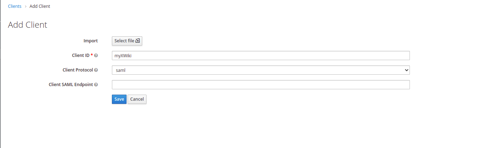
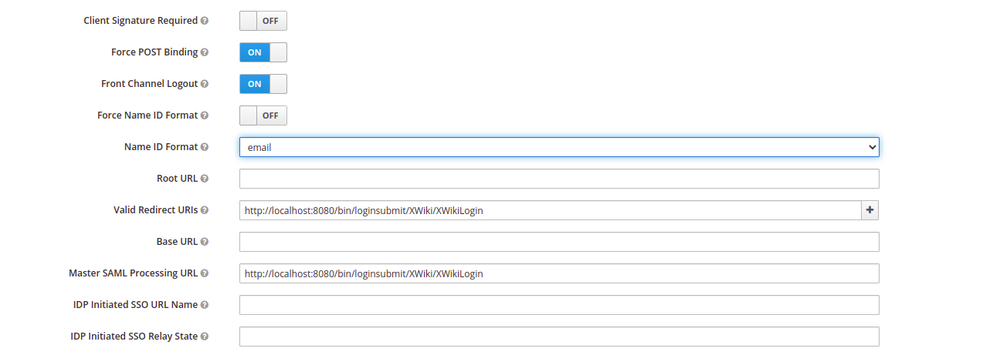
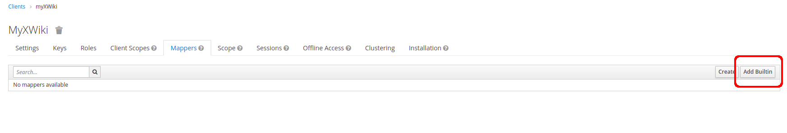
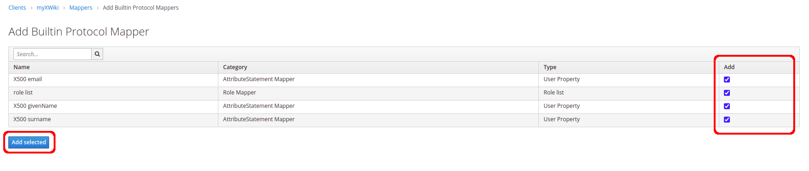
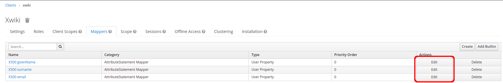
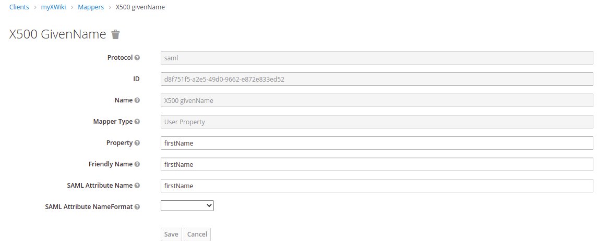
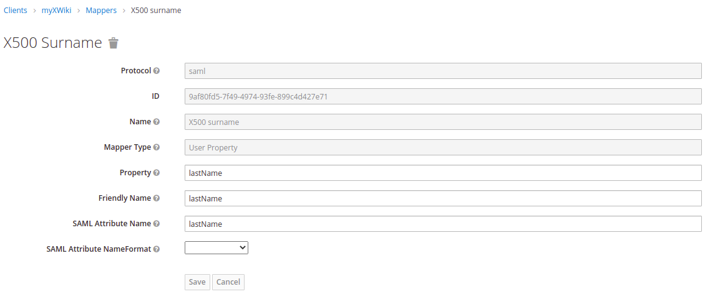
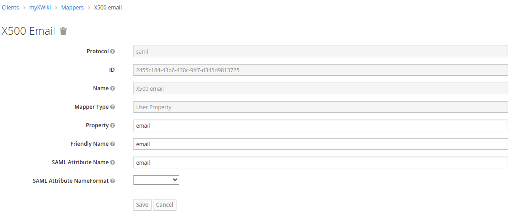
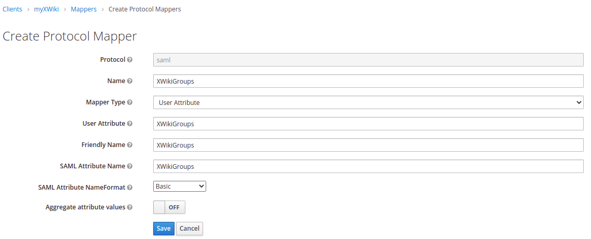

# It has been tested with KeyCloak SAML authentication.

## Step 1) Create your realm
+ [Follow the instructions in KeyCloak documentation.](https://www.keycloak.org/docs/latest/getting_started)


+ After create the new realm, you should get the ```Identity Provider Metada``` XML by clicking on the region pointed out above. 

```xml
<!--Identity Provider Metada XML Example:-->

<!-- "xwiki.authentication.saml2.idp.entityid" will come from the following attribute `entityID` -->
<EntityDescriptor xmlns="urn:oasis:names:tc:SAML:2.0:metadata" xmlns:md="urn:oasis:names:tc:SAML:2.0:metadata" xmlns:saml="urn:oasis:names:tc:SAML:2.0:assertion" xmlns:ds="http://www.w3.org/2000/09/xmldsig#" entityID="http://<keycloak-url>/auth/realms/<realm-name>">
	<IDPSSODescriptor WantAuthnRequestsSigned="true" protocolSupportEnumeration="urn:oasis:names:tc:SAML:2.0:protocol">
		<KeyDescriptor use="signing">
			<KeyInfo>
				<KeyName>
					...QmYWODphcDVdYY6pMed...
				</KeyName>
				<X509Data>
          <!-- "xwiki.authentication.saml2.idp.x509cert" will come from the following attribute -->
					<X509Certificate>
						...MIICoTCCAYkCBgF6m...
					</X509Certificate>
				</X509Data>
			</KeyInfo>
		</KeyDescriptor>
		<ArtifactResolutionService Binding="urn:oasis:names:tc:SAML:2.0:bindings:SOAP" Location="<keycloak-url>/auth/realms/<realm-name>/protocol/saml/resolve" index="0" />
		<SingleLogoutService Binding="urn:oasis:names:tc:SAML:2.0:bindings:HTTP-POST" Location="<keycloak-url>/auth/realms/<realm-name>/protocol/saml" />
		<SingleLogoutService Binding="urn:oasis:names:tc:SAML:2.0:bindings:HTTP-Redirect" Location="<keycloak-url>/auth/realms/<realm-name>/protocol/saml" />
		<SingleLogoutService Binding="urn:oasis:names:tc:SAML:2.0:bindings:HTTP-Artifact" Location="<keycloak-url>/auth/realms/<realm-name>/protocol/saml" />
		<NameIDFormat>
			urn:oasis:names:tc:SAML:2.0:nameid-format:persistent
		</NameIDFormat>
		<NameIDFormat>
			urn:oasis:names:tc:SAML:2.0:nameid-format:transient
		</NameIDFormat>
		<NameIDFormat>
			urn:oasis:names:tc:SAML:1.1:nameid-format:unspecified
		</NameIDFormat>
		<NameIDFormat>
			urn:oasis:names:tc:SAML:1.1:nameid-format:emailAddress
		</NameIDFormat>
    <!-- "xwiki.authentication.saml2.idp.single_sign_on_service.url" will come from the following attribute -->
		<SingleSignOnService Binding="urn:oasis:names:tc:SAML:2.0:bindings:HTTP-POST" Location="<keycloak-url>/auth/realms/<realm-name>/protocol/saml" />
		<SingleSignOnService Binding="urn:oasis:names:tc:SAML:2.0:bindings:HTTP-Redirect" Location="<keycloak-url>/auth/realms/<realm-name>/protocol/saml" />
		<SingleSignOnService Binding="urn:oasis:names:tc:SAML:2.0:bindings:SOAP" Location="<keycloak-url>/auth/realms/<realm-name>/protocol/saml" />
		<SingleSignOnService Binding="urn:oasis:names:tc:SAML:2.0:bindings:HTTP-Artifact" Location="<keycloak-url>/auth/realms/<realm-name>/protocol/saml" />
	</IDPSSODescriptor>
</EntityDescriptor>
```

---
## Step 2) Create Client for SAML Authentication


+ The ```Client ID``` will be referenced in the xWiki attribute settings under ```sp.entityid``` in ```xwiki.cfg```. 
+ You must be sure to choose ```SAML``` in the ```Client protocol```.
---
## Step 3) Client Settings
+ ```Client Signature Required``` should be unchecked.
+ ```Name ID Format``` the option selected should be email.
+ ```Valid Redirect URIs``` should be ```https://<you wiki domain>/bin/loginsubmit/XWiki/XWikiLogin```
+ ```Master SAML Processing URL``` should be ```https://<you wiki domain>/bin/loginsubmit/XWiki/XWikiLogin```




---
## Step 4) Client Mappers

+ Click over the "Add Builtin" button.
+ Check all fields and click over the "Add sleected" button.





+ Updating mappers.






+ Add a new group settings.



+ Create a new user.


+ Add password to user


---
## Step 5) XWiki attributes
+ The following configurations are required in the xwiki.cfg file:
```properties
# Required properties for xwiki.cfg file
xwiki.authentication.authclass=com.xwiki.authentication.saml.XWikiSAML20Authenticator
xwiki.authentication.saml2.idp.single_sign_on_service.url=<keycloak-url>/auth/realms/<realm-name>/protocol/saml
xwiki.authentication.saml2.idp.entityid=http://<keycloak-url>/auth/realms/<realm-name>
xwiki.authentication.saml2.sp.entityid=<any arbitrary string - you must use the same in the client setting `Client ID` >
xwiki.authentication.saml2.idp.x509cert=<certificate data come from Identity Provider Metada xml>
xwiki.authentication.saml2.sp.assertion_consumer_service.url=https://<you wiki domain>/bin/loginsubmit/XWiki/XWikiLogin
```
