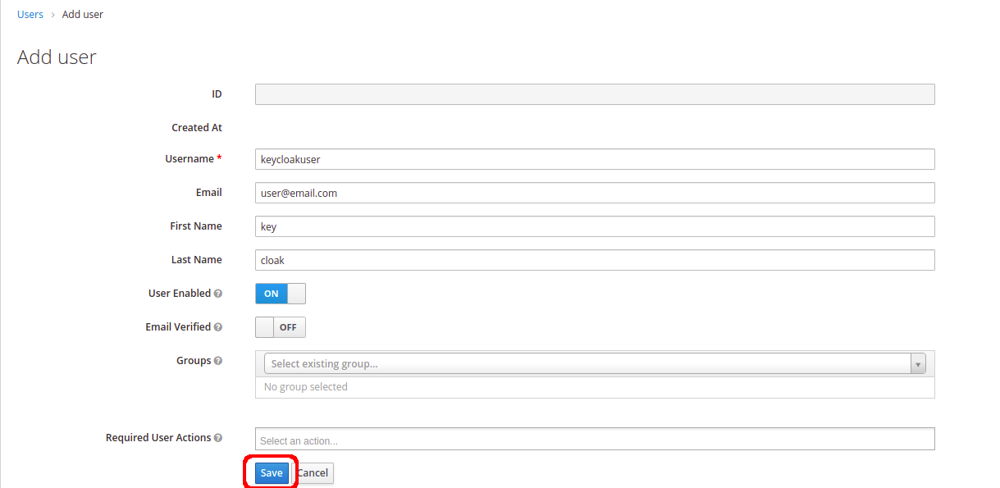
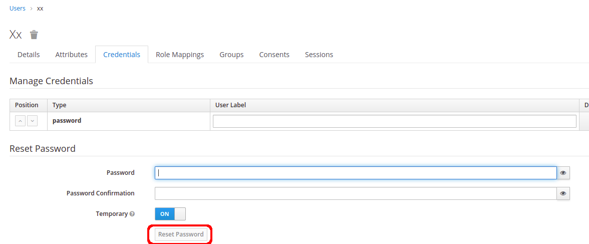
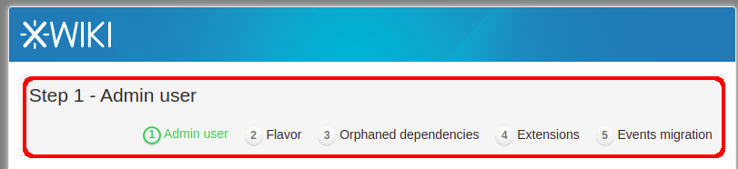
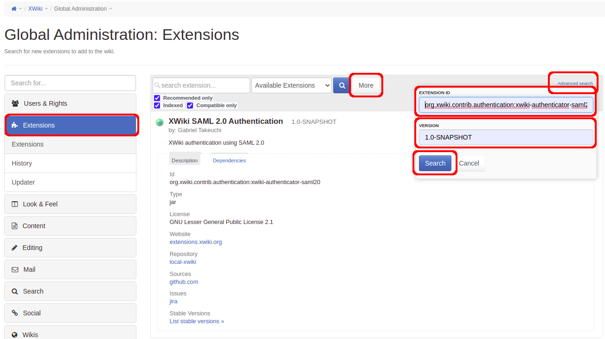

# Dev Quick Start

The purpose of this guide is to help setting up a development environment for this plugin.
Some docker containers will be used:
+ Nexus
+ Keycloak
+ Postgres
+ XWiki

### Requirements

Requirement  | Minimum version
------------ | -------------
Java    | >= 8
Maven   | >= 3.8
Docker  | >= 20
Docker-compose  | >= 1.25
Curl    | >= 7

Run the following commands inside the quick-start folder:

```sh
$ chmod +x setup.sh
$ docker-compose up -d
```

## Nexus

+ Wait until nexus is ready, it may take a while.
+ URL: http://localhost:8081
+ User: admin
+ Password: get the password running the following command:
    ```
    $ docker-compose exec nexus cat /nexus-data/admin.password
    ```
+ Add admin permission to anonymous user.
    + Go to the Administration menu, select "Users" on the sidebar and select the anonymous user.
        + Add `nx-admin` role to the anonymous user and save.
        + **!! NEVER DO THIS IN PRODUCTION EVER !!**


+ Build the extension from within the project directory to populate the repository with the current version.

    ```
    $ mvn clean deploy -DaltDeploymentRepository=repo::default::http://localhost:8081/repository/maven-snapshots
    ```

+ Verify that the plugin was deployed to the local Nexus Repository.


## Keycloak

+ URL: http://localhost:8090
+ Login at the "Administration Console"
    + User: admin
    + Password: admin
+ After the installation is finished, it's necessary to create the realm in Keycloak:
    + Go to Keycloak interface and select the option `Add realm`.
    + On "Import", select the `realm-export.json` file in the `quick-start` folder.
    + Keep the proposed `MyNewRealm` name.
    + Make sure the `Enabled` option is ON and click the `Create` button.  


+ On the tab to the left, click Users, then on the right click Add User.



+ On the Credentials tab, add user password.



## XWiki

+ URL: http://localhost:8080
+ Complete XWiki's "Distribution Wizard" setup.




+ Run the following command inside the quick-start folder:
    ```
    $ ./setup.sh
    ```

+ Login in as the administrator user you created during the "Distribution Wizard".
    + Open the new Extensions page (with the subtitle "Search for new extensions to add to the wiki.").
    
    

    + To find the extension, click the "More" button and then on "Advanced search".
    + Fill in these values:
        + EXTENSION ID: `org.xwiki.contrib.authentication:xwiki-authenticator-saml20`
        + VERSION: 1.0-SNAPSHOT
    + Click "Search".
    + Click the install button, then "continue", and wait until the installation process is finished.



+ Run the following command inside the quick-start folder:

    ```sh
    $ docker-compose restart web
    ```


## Undo the quick start

```sh
$ docker-compose down
$ docker volume rm quick-start_nexus-data quick-start_postgres-data quick-start_xwiki-data
```

---

## Manual Setup

Follow the instructions to set up a complete local environment.

1. Build the project

    ```sh
    $ mvn clean install
    ```

2. Create a folder to store the maven repository files for your wiki. Let's assume for this example it will be in the following path.

    ```sh
    /usr/local/xwiki/data/repo/org/xwiki/contrib/authentication/xwiki-authenticator-saml20/1.0-SNAPSHOT
    ```

3. Copy all plugin files from your maven local repo to the directory created on step 2.

    ```sh
    $ ~/.m2/repository/org/xwiki/contrib/authentication/xwiki-authenticator-saml20/1.0-SNAPSHOT
    ```

4. Add the following lines to `xwiki.properties`.

    ```sh
    extension.repositories=local:maven:file:///usr/local/xwiki/data/repo
    extension.repositories=maven-xwiki:maven:https://nexus.xwiki.org/nexus/content/groups/public/
    extension.repositories=extensions.xwiki.org:xwiki:https://extensions.xwiki.org/xwiki/rest/
    ```

**If you are using Google Workspace**, you need to make sure you are behind https. If you are behind a reverse proxy, you might
face issues with wrong http redirections. Try adding the following to your web.xml.
   
```sh
<filter>
    <filter-name>RemoteIpFilter</filter-name>
    <filter-class>org.apache.catalina.filters.RemoteIpFilter</filter-class>
    <init-param>
        <param-name>protocolHeader</param-name>
        <param-value>x-forwarded-proto</param-value>
    </init-param>
    <init-param>
        <param-name>remoteIpHeader</param-name>
        <param-value>x-forwarded-for</param-value>
    </init-param>
</filter>
```

== Notice ==

It is still possible to authenticate against the local authentication. To do that, open the login form URL directly:

```sh
https://<your wiki domain>/bin/login/XWiki/XWikiLogin
```
